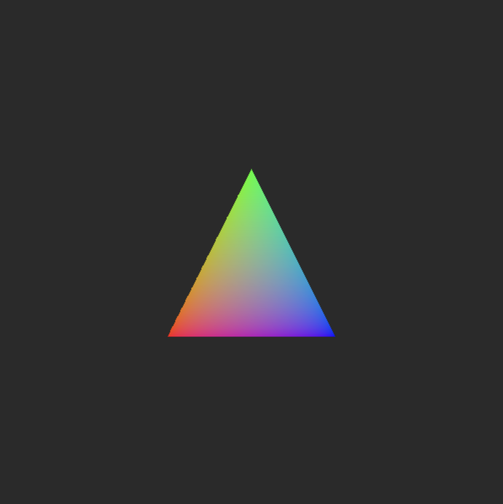

# Rast

*Rast* is a simple, `no_std` software *R*ust r*ast*erizer driven by `Shader` types.

## Example

```rust
fn colored_triangle(pixels: &mut [Srgb], width: usize, height: usize) {
    rast::rast_triangle(
        pixels,
        width,
        height,
        width as f32 / 3.0,
        height as f32 / 3.0 * 2.0,
        width as f32 / 2.0,
        height as f32 / 3.0,
        width as f32 / 3.0 * 2.0,
        height as f32 / 3.0 * 2.0,
        LinearRgb::rgb(1.0, 0.0, 0.0),
        LinearRgb::rgb(0.0, 1.0, 0.0),
        LinearRgb::rgb(0.0, 0.0, 1.0),
        ColorShader,
    );
}
```

## Demos

`cargo run --bin utah_teapot`<br>


---

`cargo run --bin texture_quad`<br>


---

`cargo run --bin colored_triangle`<br>


